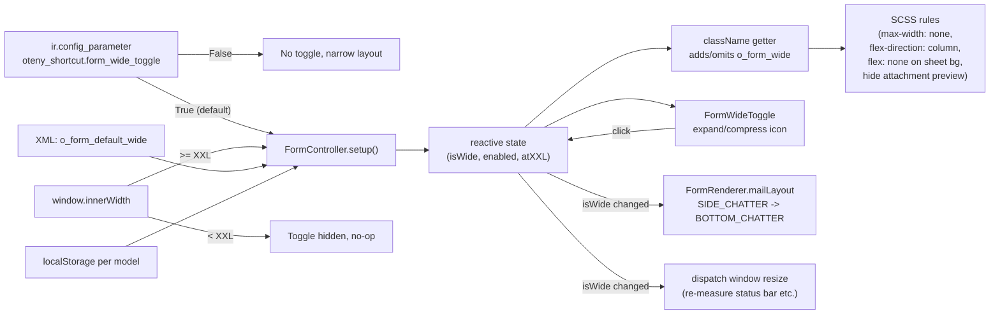

# Form Wide Toggle

A small square icon button anchored to the top-right of every form sheet flips the form between two layouts:

- **Narrow** — stock Odoo behavior, sheet capped at 1400px, chatter sits aside on XXL screens.
- **Wide** — sheet uses the full row width, chatter renders below the sheet.

The choice is remembered per model in `localStorage`. Specific forms can default to wide via the `o_form_default_wide` marker class. A System Parameter (`oteny_shortcut.form_wide_toggle`, default `"True"`) globally enables or disables the feature.

## Why This Exists

The Odoo form sheet is capped at 1400px so the chatter (or attachment preview) can sit aside on big monitors at the XXL breakpoint. Some forms have wide tables in their tabs — for example the crewradar Employee form's Logbook, Vacation, Airfare, and Timesheets tabs — that become unreadable inside the 1400px cap and force horizontal scrolling.

A previous workaround (`riverflow_force_xl.js`) capped the global UI breakpoint to XL so the chatter would always render below, which gave the sheet the full screen width. That solution had to be removed because it also disabled the PDF/image attachment preview sidebar — which only activates at the XXL breakpoint — making invoice and credential forms harder to use.

The Form Wide Toggle replaces that all-or-nothing global hack with a per-form, per-user choice. Users get the standard layout where it makes sense (forms with attachment previews like invoices, forms with little horizontal data) and switch to wide where it helps (forms with wide tables). Specific forms can be marked to default to wide so the right behavior is on at first sight without configuration.

## How It Works for Users

Every form view shows a small square icon button in the top-right corner of the form sheet:

- **Expand icon** (`fa-expand`): the form is currently narrow. Click to switch to wide.
- **Compress icon** (`fa-compress`): the form is currently wide. Click to switch back to narrow.

The choice is stored in the browser's `localStorage` per Odoo model. Setting an Employee form to wide once keeps it wide for every employee thereafter on that browser; the choice is independent per model, so changing the Employee form does not change the Invoice form.

### Wide Mode and the Attachment Preview Sidebar

Some forms (credentials, draft invoices) declare a `<div class="o_attachment_preview"/>` that mail's compiler turns into a side-by-side PDF/image preview at the XXL breakpoint. Because wide mode reshapes the form into a single column (sheet on top, chatter below), the attachment preview is **automatically hidden** when wide mode is on — leaving it visible would render it as an ugly full-width band below the sheet.

The toggle button itself stays available on these forms, so the user can flip back to narrow whenever they want to see the preview again. Stock Odoo's own conditional `invisible="..."` guards on the preview (like `account.move`'s state-driven hide) still apply in narrow mode unchanged.

### When the Toggle Is Hidden

The toggle button is hidden in three cases:

1. **Inside dialogs** (`target='new'` wizards) — the wide/narrow choice is meaningless on a transient dialog.
2. **Below the XXL breakpoint** (viewport `< ~1400px`) — at smaller widths Odoo already stacks the chatter beneath the sheet, so wide mode would have no visible effect. Resizing the browser window across the XXL boundary makes the button appear/disappear live.
3. **System parameter disabled** — see below.

### Where the Wide Setting Comes From

When a form opens, the layout is decided in this order (first match wins):

1. **System parameter `oteny_shortcut.form_wide_toggle` is `"False"`** → toggle is hidden, form uses standard Odoo layout.
2. **localStorage has a stored choice for this model** → that choice wins (`"wide"` or `"narrow"`).
3. **The form view's XML declares `class="o_form_default_wide"`** → form opens wide on first visit.
4. **Otherwise** → narrow.

### Disabling the Feature Globally

An administrator can hide the toggle button system-wide by setting **Settings > Technical > System Parameters** key `oteny_shortcut.form_wide_toggle` to `"False"`. The form layout falls back to stock Odoo (1400px cap, chatter aside at XXL). The default value `"True"` is loaded on module install.

The system parameter is fetched once per page load and cached in memory across all forms; toggling it requires a page refresh to take effect for users currently logged in.

### Forms That Default to Wide

| Form | Reason |
|------|--------|
| `hr.employee` (crewradar Employee form) | Logbook, Vacation, Airfare, and Timesheets tabs contain wide tables that benefit from full-width display |

To default another form to wide, add `class="o_form_default_wide"` to the `<form>` element via a view inheritance — see the Technical Reference section below.

## Technical Reference

### Two CSS Classes

The feature uses two distinct classes to keep the XML default cleanly separated from the runtime state:

| Class | Where set | Effect |
|-------|-----------|--------|
| `o_form_default_wide` | XML on `<form>` | Marker only — read by FormController on setup to seed the initial wide preference. Has no CSS effect by itself. |
| `o_form_wide` | Added/removed by FormController.className getter | The active CSS class — removes the 1400px max-width, switches the renderer to flex-column, neutralizes the XXL flex rule on the sheet bg. |

### Layout Decision Flow



### File Layout

```
oteny_shortcut/
├── data/
│   └── ir_config_parameter_data.xml         # Default-on system parameter
└── static/src/components/form_wide_toggle/
    ├── form_wide_toggle.js   # Component class + 3 prototype patches
    ├── form_wide_toggle.xml  # QWeb template for the icon button
    └── form_wide_toggle.scss # Layout SCSS + button styling
```

### The Three Patches

The implementation extends Odoo's stock form view via three coordinated `patch()` calls:

#### 1. `FormController.prototype` — state and class management

- Reads `o_form_default_wide` marker from `props.className`, `localStorage["oteny_shortcut.form_wide.<resModel>"]`, and the cached system parameter
- Creates a reactive `useState({ enabled, isWide, atXXL })` and exposes it on `this.formWide` and via `useSubEnv({ formWide })` so child components in the renderer can read it
- `useExternalListener(window, "resize", ...)` keeps `state.atXXL` in sync with `ui.size >= SIZES.XXL`
- `useEffect(..., () => [state.isWide])` dispatches a synthetic `window.resize` event after each toggle so resize-aware components (status bar segment overflow detection, list view column widths, attachment preview sizing) re-measure against the new layout
- Overrides the `className` getter to add `o_form_wide: true` when `state.isWide`

#### 2. `FormRenderer.prototype` — component registration + chatter layout override

- `setup()` adds `this.otenyComponents = { FormWideToggle }` so the compiler-emitted `<t t-component="__comp__.otenyComponents.FormWideToggle"/>` resolves at render time. This mirrors mail's `mailComponents.Chatter`.
- `mailLayout(...args)` is overridden to convert `"SIDE_CHATTER"` → `"BOTTOM_CHATTER"` when `state.isWide`. This is the key to the wide layout actually working: without this, the chatter container keeps its `o-aside` class with a fixed ~530px width, and the sheet shares the row regardless of its own `max-width`. Other layouts (`COMBO`, `BOTTOM_CHATTER`, `EXTERNAL_*`, `NONE`) pass through unchanged.
- The `super.mailLayout?.(...)` optional chaining guards the case where the mail module is not installed (no chatter on the form, the patch becomes a no-op).

#### 3. `FormCompiler.prototype.compileSheet` — toggle injection

After calling `super.compileSheet()`, the patch finds `.o_form_sheet` (the inner sheet element, which already has `position: relative`) and prepends a compiled `<t t-component>` node referencing the toggle. The `t-if` guard hides the toggle in dialogs, when the system parameter is off, and below the XXL breakpoint:

```js
"t-if":
    "!__comp__.env.inDialog and __comp__.env.formWide" +
    " and __comp__.env.formWide.state.enabled" +
    " and __comp__.env.formWide.state.atXXL",
```

### SCSS Rules

The wide layout reshapes the XXL form rendering into the legacy "narrow XL" behavior — chatter below, sheet full-width — without affecting < XXL screens (which already render that way).

```scss
.o_form_view.o_form_wide .o_form_renderer {
    flex-direction: column;          // overrides the XXL row layout
}

.o_form_view.o_form_wide .o_form_sheet_bg {
    max-width: none;                 // removes the 1400px cap
    flex: none;                      // resets `flex: 2 1 990px` from .o_xxl_form_view
                                     // (in column flex, that 990px would be HEIGHT)
}

.o_form_view.o_form_wide .o_attachment_preview {
    display: none;                   // hidden in wide mode (would otherwise
                                     // render as a full-width band below the
                                     // sheet because of the column flex above)
}
```

The toggle button itself is a 28x28 square with a subtle border and Bootstrap-variable colors so it adapts to dark mode without a separate `.dark.scss` file.

### Why "it works on invoices but not credentials" (resolved)

The first wide-mode draft did not hide `.o_attachment_preview` and produced an ugly full-width band below the sheet on the rivercreds credential form. Stock Odoo invoice forms (`account.move`) appeared to "work" only because their preview is gated by `invisible="move_type not in ('out_invoice', ...) or state != 'draft'"` — on posted records the preview was already hidden, masking the bug. The credential form declares `<div class="o_attachment_preview"/>` unconditionally, so the bug was visible there. Adding the `display: none` rule above hides the preview universally in wide mode, which is the correct UX: a user opting into a wider form sheet is also opting out of the side-by-side preview.

### Reactivity Subtleties

Two OWL-reactivity gotchas were resolved during implementation:

#### Toggle icon would freeze without `useState` in the child component

OWL's `useState` only auto-subscribes the **component that calls it**. The `FormController` calls `useState`, so it re-renders when `state.isWide` flips. But child components reading the same proxy via env do NOT auto-subscribe; they have to opt in by calling `useState(this.env.formWide.state)` themselves. The `FormWideToggle` component does this in its setup; without it, the form layout would change on each click but the toggle's own icon would not update until a refresh.

#### Status bar overflow detection would stay stale

Odoo's `StatusBarField` uses `useExternalListener(window, "resize", throttleForAnimation(adjust))` to recompute which segments fit and which collapse to a `"..."` dropdown. Toggling wide/narrow changes the available width without firing a resize, so the status bar kept stale measurements (e.g. segments visibly overflowing horizontally after wide → narrow). The `useEffect` on `state.isWide` in FormController dispatches a synthetic `window.resize` after OWL has patched the DOM and the browser has applied layout — letting the status bar (and any other resize-aware components) re-measure correctly.

### Defaulting a Form to Wide via Inheritance

To pre-set a form to wide on first visit, add the marker class via a standard view inheritance:

```xml
<record id="..." model="ir.ui.view">
    <field name="inherit_id" ref="hr.view_employee_form"/>
    <field name="arch" type="xml">
        <xpath expr="//form" position="attributes">
            <attribute name="class" add="o_form_default_wide" separator=" "/>
        </xpath>
    </field>
</record>
```

The `add="..."` + `separator=" "` syntax preserves any other classes already declared on the `<form>` element (Odoo merges via space-separated tokens).

### Dependencies

- `web` only — works on any Odoo 19 form view, with or without the mail module loaded
- The mail-related patch (`FormRenderer.mailLayout` override) gracefully no-ops via optional chaining when mail is not installed and `mailLayout` is not on the prototype
